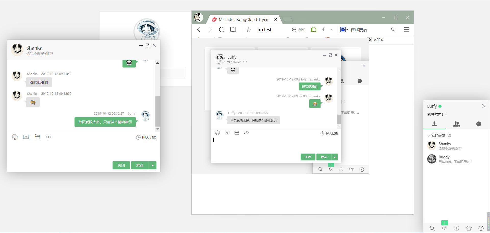

# js-rongcloud-layim

融云 + layim 单页式 demo

因部分功能需要依赖服务端，这里只做简单的演示。

另外因为 layim 为付费组件，代码已删除 layim.js，请获取授权后自行引入该文件。

演示地址: [ [ 点我 ] ](https://www.m-finder.com/im)

#### 已实现功能
* ~~获取token~~ (未使用，会泄漏融云密钥)
* ~~获取好友列表~~（模拟，需要后端实现）
* ~~获取群成员~~（模拟，需要后端实现）
* ~~单聊~~
* ~~群聊~~
* ~~自定义消息~~
* ~~好友上线通知~~（模拟，需要后端实现）